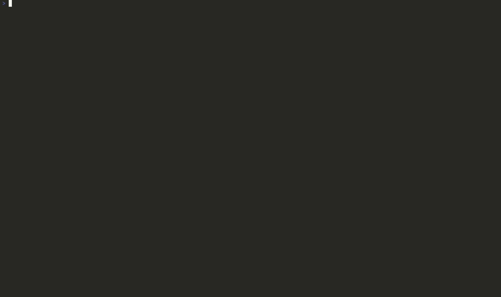

<!-- panvimdoc-ignore-start -->

<div align="center">

# differ.nvim

**Your whole diff and review loop in one Neovim plugin: local diffs, file history, staging, PR review, and merge conflicts, all with the same UX.**

[](https://github.com/undont/differ.nvim/actions)
[](https://github.com/undont/differ.nvim/releases/latest)
[](LICENCE)
[](https://www.lua.org)
[](https://go.dev)
[](https://neovim.io)

[Installation](#installation) · [Configuration](#configuration) · [Usage](#usage) · [Recipes](RECIPES.md)

</div>



<!-- panvimdoc-ignore-end -->

## Why this exists

You can already get most of the functionality from combining some existing plugins (I was using diffview + octo.nvim with custom keymaps), but for me, it just never felt like a cohesive experience. I wanted to see how feasible it would be to build everything together, and what the result *could* feel like.

Everything runs through one renderer, so staging a hunk and replying to a review comment behave like the same tool; that covers local diffs against any revspec, file history for a single file or a branch range, hunk and file-level staging, PR review with inline threads and all of the lifecycle of a PR around it, and a 3-way (or 4-way if you choose) merge tool that resolves into the working-tree file. All of these views get data from the same diff engine (using `vim.text.diff()`).

The default view is a stacked dual-rail layout: one scroll surface with old and new lines interleaved per hunk. Side-by-side layout is available in the config or with a toggle in-session. Word-level highlighting and Treesitter syntax are on by default, and every surface is real buffer lines rather than virtual text, so search, yank and motions work as normal.

The GitHub side runs in a separate process rather than the editor, so opening a PR or posting a review doesn't block on the API, and results are cached between calls.

## Requirements

- Neovim 0.12+ and git
- `termguicolors` on (usually already the case; without it the highlights render uncoloured)
- For PR review: Go, make, and an authenticated `gh`
- A Treesitter parser for the languages you diff (optional)

`:checkhealth differ` reports which of these are satisfied.

## Installation

### [lazy.nvim](https://github.com/folke/lazy.nvim)

```lua
{
  "undont/differ.nvim",
  build = "make go-build",
  config = function()
    require("differ").setup()
  end,
}
```

`setup()` is only needed to change defaults and register highlight groups eagerly.

The `build` hook compiles the Go sidecar (used by PR review) on install and update. It needs Go and make on `PATH`; if you're only here for local diffs, feel free to drop the hook.

### vim.pack

Neovim 0.12+. `vim.pack` has no inline build key, so the best solution is to register a `PackChanged` hook (before `vim.pack.add`, so it also runs on first install):

```lua
vim.api.nvim_create_autocmd("PackChanged", {
  callback = function(ev)
    if ev.data.spec.name == "differ.nvim" and (ev.data.kind == "install" or ev.data.kind == "update") then
      vim.system({ "make", "go-build" }, { cwd = ev.data.path }):wait()
    end
  end,
})

vim.pack.add({ "https://github.com/undont/differ.nvim" })
require("differ").setup()
```

You can also pin a release with `{ src = "https://github.com/undont/differ.nvim", version = "v0.1.1" }`, or follow a range with `version = vim.version.range("0.1")`.

### [mini.deps](https://github.com/nvim-mini/mini.nvim/blob/main/readmes/mini-deps.md)

mini.deps splits the build hook in two, so differ needs both. `post_install` fires on the initial clone and `post_checkout` on every update, so wiring only the first leaves updates on the binary built at install time, and only the second never builds one at all:

```lua
local build = function(args)
  vim.system({ "make", "go-build" }, { cwd = args.path }):wait()
end

MiniDeps.add({
  source = "undont/differ.nvim",
  hooks = { post_install = build, post_checkout = build },
})
require("differ").setup()
```

### Other managers

differ's only install step is building the Go sidecar, so point your manager's build hook at `make go-build`. Managers with one hook covering both install and update need a single key: pckr `run`, vim-plug `do`, paq `build`.

Wiring the install hook but not the update one leaves a stale binary. If you're in doubt, `:Differ sidecar` reports which one is actually running.

## Configuration

`setup()` merges over these defaults:

```lua
require("differ").setup({
  base = nil,                    -- base branch for `base`/`log base`; nil auto-detects origin/HEAD
  relative_dates = false,        -- "3 days ago" instead of YYYY-MM-DD wherever a date shows
  command_alias = nil,           -- extra :command(s) routing to :Differ, e.g. "D" or { "D", "Df" }
  panel = {                      -- can also be overridden with :Differ panel <position> in-session
    position = "right",          -- "bottom" | "top" | "left" | "right"
    height = 9,                  -- only applies to top/bottom
    width = 35,                  -- only applies to left/right
    listing = "tree",            -- "tree" | "name" (tree/flat list)
    icons = true,                -- (requires nvim-web-devicons)
    progress = true,             -- list position meter in the panel winbar
  },

  layout = "stacked",            -- "stacked" | "split" (can be toggled with :Differ layout in-session)
  context = math.huge,           -- fold threshold; math.huge = whole file, no folds
  wrap = true,                   -- soft-wrap long lines in the diff view
  diff_counter = true,           -- hunk counter in the diff window's winbar
  cursorline_tint = true,        -- allow the cursorline to inherit the add/delete highlights
  deep_diff = {                  -- word-level diffing
    enabled = true,
    granularity = "word",        -- "word" | "char"
    similarity_threshold = 0.5,  -- line-pairing cutoff for word-level diffing
  },

  history = {                    -- log/history sidebar default placement/size
    position = "bottom",         -- "bottom" | "top" | "left" | "right"
    height = 10,                 -- only applies to top/bottom
    width = 40,                  -- only applies to left/right
  },

  merge = {                      -- no override in-session
    layout = "default",          -- "default" (ours | theirs) | "diff4" (adds base)
  },

  comments = {                   -- in pr review threads
    display = "peek",            -- "expanded" | "peek" | "markers"
                                 -- "expanded" doesn't collapse any, all stay open
                                 -- "peek" has boxes below the line, opening on the cursor's row
                                 -- "markers" gives eol markers with a float, which split
                                 -- always does anyway
  },
  sidecar_bin = nil,             -- override the go sidecar path

  keymaps = {
    next_hunk = "]c",
    prev_hunk = "[c",
    next_file = "]f",
    prev_file = "[f",
    first_file = "gg",
    last_file = "G",
    next_section = "]]",         -- sections in the panel, commits in log
    prev_section = "[[",
    scroll_down = "f",           -- shadows native f/b; set false to restore
    scroll_up = "b",
    select = { "<CR>", "o" },
    help = "g?",
    close = "dc",                -- end the session
    toggle_panel = "dd",         -- hide/show the file panel

    -- diffs
    toggle_layout = "dl",        -- flip between stacked / split
    more_context = "d=", less_context = "d-",
    stage = "s", unstage = "u",  -- stage/unstage[all] work on hunks/files (diff buffer/panel)
    stage_all = "S", unstage_all = "U",
    discard = "X",               -- revert works on hunks/files (diff buffer/panel)
    edit_file = "df",            -- open window to edit current file
    goto_file = "de",            -- open the real file and close the session; in a pr it opens
                                 -- the real file in a new tab
    toggle_listing = "i",        -- tree/flat list
    close_node = "c",
    close_all = "C",
    open_all = "O",
    refresh = "R",               -- refreshes the panel (as a safety net, it shouldn't go stale)
    toggle_fold = "za",
    details = "K",               -- in the log panel to see full commit messages

    -- mergetool
    next_conflict = "]x", prev_conflict = "[x", -- step between conflicts
    next_marker = "]n", prev_marker = "[n",  -- step between conflict markers
    choose_ours = "<leader>co", choose_theirs = "<leader>ct", choose_base = "<leader>cb",
    choose_all = "<leader>ca",   -- take both (ours then theirs)
    choose_none = "<leader>cx",  -- drop the conflict region

    -- pr
    toggle_viewed = "<Tab>",
    next_unviewed = "]u", prev_unviewed = "[u",
    next_thread = "]t", prev_thread = "[t",
    comment = "ga",              -- comment on the line (normal) or selection (visual)
    reply = "gp",                -- reply to the thread under the cursor
    delete_comment = "gx",       -- delete the latest comment of the thread
    toggle_thread = "gc",        -- collapse/expand the thread under the cursor
    resolve_thread = "gr",       -- resolve/unresolve the thread under the cursor
    overview = "go",             -- back to the PR overview home
    review_submit = "gS",        -- submit the pending review
    review_discard = "gD",       -- discard the pending review and its drafts
  },
})
```

The highlight groups differ defines are listed in [recipes](RECIPES.md#highlight-groups) (`:h differ-recipes-highlight-groups`); all carry `default = true`, so a `:highlight` of your own wins.

## Usage

`:Differ [revspec]` opens the file panel over the changed files for a resolved source, landing on the file you ran it from at its closest modified hunk, or on the first file in the list when your current file isn't one of them. I modelled this on git's grammar:

| Command | Diffs |
|---|---|
| `:Differ` | `HEAD` vs worktree (all uncommitted) |
| `:Differ <rev>` | `<rev>` vs worktree |
| `:Differ <a>..<b>` | `<a>` vs `<b>` (two-dot) |
| `:Differ <a>...<b>` | merge-base(`<a>`, `<b>`) vs `<b>` |
| `:Differ <a>...` | merge-base vs worktree (branch total) |
| `:Differ <a> <b>` | `<a>` vs `<b>` |
| `:Differ base` | branch total vs the base branch; `base` auto-detects `origin/HEAD` |
| `:Differ log [path]` | history of one file, commit by commit; no argument takes the current buffer |
| `:Differ log <range>` | branch-range history, driving commit then file |
| `:Differ log base` | branch-range history of `<base>...HEAD` |

Sources with worktree on the new side (`:Differ`, `:Differ <rev>`, `:Differ <a>...`) also list untracked files. `git diff` can't see them whatever refs you pass it, so differ unions in `git ls-files --others --exclude-standard` to bring them in with the other changes.

### Runtime controls

| Command | Effect |
|---|---|
| `:Differ layout [stacked\|split]` | Set layout; no argument toggles between |
| `:Differ panel [left\|right\|top\|bottom]` | Reposition the live panel or history sidebar |
| `:Differ context full` | Show the whole file, no folds (the default) |
| `:Differ context <n>` | Set the fold threshold around hunks |
| `:Differ context +` / `-` | Widen / narrow the threshold by one |

`context` decides where a native fold forms once an unchanged run exceeds it either side of a hunk; every line is in the buffer either way, so search, yank and motions are unaffected. Folds are created open, so nothing is hidden until you close one (`zc` / `za` / `zM`). `d-` narrows out of whole-file by landing on a threshold of 10 and stepping down from there; `d=` has nothing wider to reach, so it does nothing.

Set `command_alias` in `setup()` to register a shorter name for the same command, e.g. `command_alias = "D"` gives `:D HEAD~1`, `:D log`. If you lazy-load on `cmd`, list the alias there too (`cmd = { "Differ", "D" }`); see [troubleshooting](TROUBLESHOOTING.md#command_alias-and-lazy-loading) (`:h differ-troubleshooting-command_alias-and-lazy-loading`) for why.

### PR review

`:Differ pr [<n>]` opens a pull request and lands on the overview, its home page; no argument lists the repo's PRs and picks from them. `owner/repo#<n>` targets another repo, which is how you reach a fork. From the overview, `e` enters the files and `r` enters and starts a review; `<CR>` on a thread jumps straight to that comment's file and line. The review keymaps (`ga` comment, `gp` reply, `gr` resolve, `<Tab>` viewed) are live once you're in the diff.

| Command | Effect |
|---|---|
| `:Differ pr [<n>]` | Open a PR on its overview; no argument picks from the repo's open PRs |
| `:Differ pr <owner>/<repo>#<n>` | Open a PR in another repo, e.g. a fork |
| `:Differ pr list [filter]` | List pull requests. The filter is `open` (the default), `mine`, or `review_requested` |
| `:Differ pr view [<n>]` | Enter the diff read-only, without starting a review |
| `:Differ pr overview` | Back to the overview from anywhere in the session (same as the `go` keymap) |
| `:Differ pr checks` | The CI checks view for the open PR |

Review drafts are a separate group. A review accumulates comments locally and posts them in one submission:

| Command | Effect |
|---|---|
| `:Differ pr review [<n>]` | Start (or resume) a review; a number opens that PR and starts one |
| `:Differ pr review resume` | Resume the pending review on the active session |
| `:Differ pr review submit` | Submit the pending review and its drafts. The `gS` key |
| `:Differ pr review discard` | Discard the pending review and its drafts. The `gD` key |

The lifecycle verbs act on the active session's PR:

| Command | Effect |
|---|---|
| `:Differ pr merge [method]` | Merge the PR; the method is `squash`, `merge`, or `rebase` |
| `:Differ pr checkout` | Check the PR branch out locally |
| `:Differ pr ready` / `draft` | Flip the PR between ready-for-review and draft |
| `:Differ pr close` / `reopen` | Close or reopen the PR |
| `:Differ pr browser` | Open the PR on github.com |
| `:Differ pr url` | Yank the PR's URL to the system clipboard |

### Session and sidecar commands

| Command | Effect |
|---|---|
| `:Differ gofile` | Open the real file at the cursor's mapped line and end the session. The `de` key |
| `:Differ edit` | Edit the real file in a transient split at the cursor's mapped line, keeping the session; `:w` re-sources the diff. The `df` key |
| `:Differ mergetool [path]` | Open the merge tool on a conflicted file; no argument takes the current file, else the only conflicted one, else a picker |
| `:Differ sidecar` | Smoke-check the Go sidecar: start it, round-trip a handshake, and report the binary and protocol version |
| `:Differ sidecar stop` | Stop the supervised sidecar; the next PR command starts a fresh one |
| `:Differ cache clear` | Flush the sidecar's in-process caches (file blobs and PR review threads) |

`:checkhealth differ` reports the requirements, your `setup()` options, the resolved sidecar and its handshake, and a GitHub token if one is available. [Troubleshooting](TROUBLESHOOTING.md) (`:h differ-troubleshooting.txt`) covers what to do when one of them is wrong.

### Lua API

```lua
-- Same as :Differ, for binding keys:
require("differ").open("main...")

-- Render any old/new text pair directly:
require("differ").diff({
  path = "lua/foo.lua",
  old_text = old,
  new_text = new,
  old_rev = "HEAD",
  new_rev = "WORKTREE",
})

-- Open (or toggle) the file panel over a rev spec; opts are runtime, not
-- setup config: position, listing ("tree"|"name"), height, width:
require("differ").panel({ rev = "main...", position = "left" })

-- Single-file history (opts.path defaults to the current buffer):
require("differ").file_history({ path = "lua/foo.lua" })

-- Branch-range history, driving commit -> file -> diff:
require("differ").range_history({ range = "origin/HEAD...HEAD" })

-- Open the PR frontend, jumping straight to a PR number:
require("differ").pr_open({ number = 42 })

-- Hunk nav with a fallback for the first/last hunk (or an in-history
-- commit boundary), e.g. to step to the next/previous file:
require("differ").goto_hunk("next", {
  fallback = function(direction)
    return require("differ").active_view():step_file(direction)
  end,
})
```

Launchers for the entry points differ leaves unbound, and a lualine drop-in for the diff buffers' private filetype, are in [recipes](RECIPES.md) (`:h differ-recipes.txt`).
